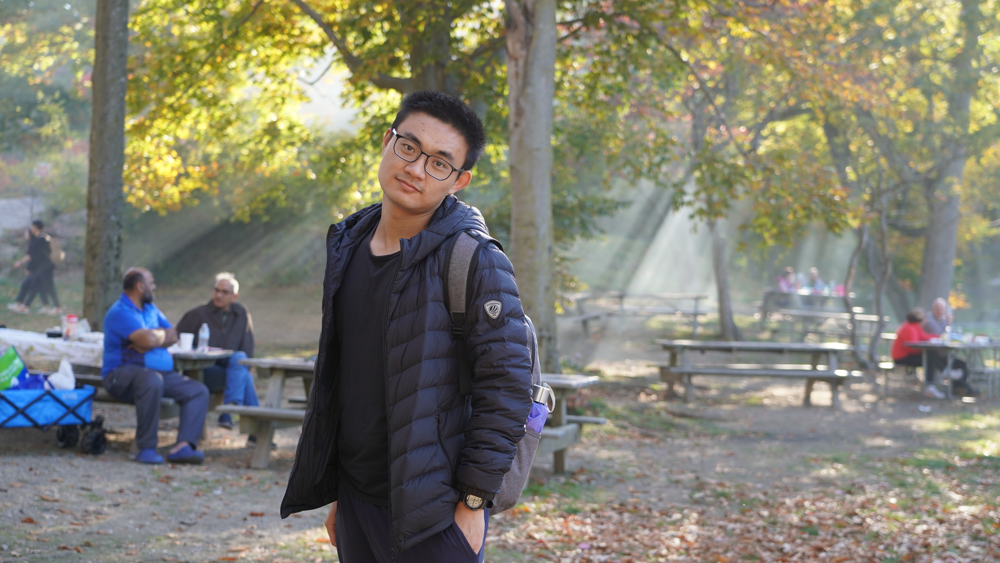

---                                                                                                                                                                                                                 
title: Home
has_children: false
nav_order: 1
---

# Welcome to Yifan's website!

You may find useful notes and resources here.

# About me
## Yifan Li 李一帆

- **1998**: Born in Yinchuan, Ningxia, China

- **2016.09 - 2020.07**: Undergraduate, Chemistry, Peking University, Beijing, China

- **2021.08 - Present**: PhD study with [Professor Roberto Car](https://chemistry.princeton.edu/faculty-research/faculty/roberto-car/), 

&emsp;&emsp;&emsp;&emsp;&emsp;&emsp;&emsp;&emsp;&emsp;&emsp;&nbsp; Department of Chemistry, Princeton University, NJ, USA

## Follow me
- **Github**: [Yi-FanLi](https://github.com/Yi-FanLi)
- **Google Scholar**: [Yifan Li](https://scholar.google.com/citations?user=s90eYOQAAAAJ&hl=en)
- **ResearchGate**: [Yifan Li](https://www.researchgate.net/profile/Yifan-Li-108)
- **Twitter**: [@YifanLi35738914](https://twitter.com/YifanLi35738914)

## Contact me
- **University Email**: [yifanl@princeton.edu](yifanl@princeton.edu)
- **Permanent Email**: [yifanl0716@gmail.com](yifanl0716@gmail.com)